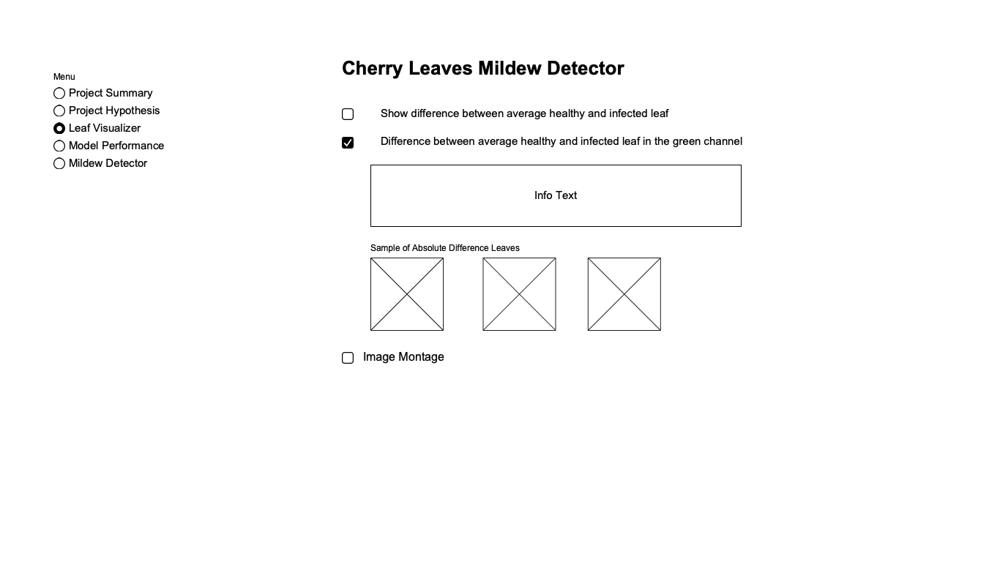

**Powdery Mildew Detector App**

The Powdery Mildew Detector is an application designed to predict whether cherry leaves are healthy or infected with powdery mildew. The app utilizes a supervised, single-label, binary classification machine learning model. Specifically, a binary classifier is employed to predict the outcome based on an image of a cherry leaf, categorizing it as either healthy or infected.

[View Live Project](https://share.streamlit.io/robert-s-lee/powdery-mildew-detector-app/main/app.py)

---

<br>


---

# Table of Contents

- [Table of Contents](#table-of-contents)
- [Data Content](#data-content)
- [Project Overview](#project-overview)
  - [Business Requirements](#business-requirements)
    - [Business Requirement 1](#business-requirement-1)
    - [Business Requirement 2](#business-requirement-2)
  - [Dashboard Expectations](#dashboard-expectations)
  - [Note to Developers](#note-to-developers)
- [Business Assessment Case: Farmy \& Foods Cherry Leaf Detection](#business-assessment-case-farmy--foods-cherry-leaf-detection)
  - [Executive Summary](#executive-summary)
  - [Business Problem](#business-problem)
  - [Objectives](#objectives)
  - [Proposed Solution](#proposed-solution)
    - [Machine Learning System](#machine-learning-system)
    - [Dashboard Requirements](#dashboard-requirements)
  - [Benefits](#benefits)
  - [Challenges](#challenges)
  - [Next Steps](#next-steps)
  - [Success Metrics](#success-metrics)
  - [Conclusion](#conclusion)
- [Project Execution](#project-execution)
  - [Analysis and Findings](#analysis-and-findings)
    - [Average Images and Variability](#average-images-and-variability)
    - [Differences between Classes](#differences-between-classes)
    - [Image Montages](#image-montages)
  - [Model Development](#model-development)
  - [Project Breakdown](#project-breakdown)
    - [Epics and User Stories](#epics-and-user-stories)
    - [Ethical and Privacy Concerns](#ethical-and-privacy-concerns)
    - [Model Selection and Image Shape Considerations](#model-selection-and-image-shape-considerations)
  - [Dashboard Expectations](#dashboard-expectations-1)
    - [Pages:](#pages)
  - [Model Selection and Transformations](#model-selection-and-transformations)
- [Project Plan: Visual Differentiation of Cherry Leaves](#project-plan-visual-differentiation-of-cherry-leaves)
  - [Project Steps and Milestones](#project-steps-and-milestones)
    - [Step 1: Information Gathering and Data Collection](#step-1-information-gathering-and-data-collection)
    - [Step 2: Data Visualization, Cleaning, and Preparation](#step-2-data-visualization-cleaning-and-preparation)
    - [Step 3: Model Training, Optimization, and Validation](#step-3-model-training-optimization-and-validation)
    - [Step 4: Dashboard Planning, Designing, and Development](#step-4-dashboard-planning-designing-and-development)
    - [Step 5: Dashboard Deployment and Release](#step-5-dashboard-deployment-and-release)
  - [User Stories](#user-stories)
- [Dashboard Design and Development](#dashboard-design-and-development)
  - [Wireframes](#wireframes)
  - [Dashboard Implementation](#dashboard-implementation)
    - [Project Summary Page](#project-summary-page)
    - [Project Hypothesis Page](#project-hypothesis-page)
  - [](#)
    - [Visual Differentiation Study Findings Page](#visual-differentiation-study-findings-page)
    - [Prediction Interface Page](#prediction-interface-page)
    - [Model Performance Page](#model-performance-page)
  - [Testing](#testing)
- [Technologies Used](#technologies-used)
  - [Languages](#languages)
  - [Software](#software)
  - [Frameworks](#frameworks)
  - [Data Analysis and Machine Learning Libraries](#data-analysis-and-machine-learning-libraries)
  - [Other Technologies](#other-technologies)
  - [Bugs and Fixes](#bugs-and-fixes)
- [Bug: Unwanted .DS\_Store Files in Project Directories](#bug-unwanted-ds_store-files-in-project-directories)
  - [Issue Description](#issue-description)
  - [Solution](#solution)
  - [Conclusion](#conclusion-1)
  - [Deployment](#deployment)
    - [Deployment Steps](#deployment-steps)
  - [Credits](#credits)
  - [Information sources](#information-sources)

# Data Content

The image dataset used in this project was sourced from [Kaggle](https://www.kaggle.com). The project employs a fictional user story to apply predictive analytics, showcasing the practical application of such techniques in a real-world scenario.

**Dataset Details:**

- The dataset comprises over 4000 images of cherry leaves, categorized as either healthy or diseased. These images were captured in Farmy & Foods crop fields.
- Diseased cherry leaves in the dataset exhibit powdery mildew, a fungal disease with broad implications for various plants.
- The presence of powdery mildew is a significant concern for the company, as it has the potential to compromise the overall quality of their agricultural products.

<br>


**Dataset Link:**

- The dataset can be accessed at the following link: [Cherry Leaves Dataset](https://www.kaggle.com/datasets/codeinstitute/cherry-leaves)

<br>

---

# Project Overview

## Business Requirements

### Business Requirement 1

The study should include the following analyses:

1. **Average Images and Variability Images:**

   - Calculate average images for each class (healthy or powdery mildew).
   - Analyze variability images for each class.

2. **Differences between Average Healthy and Average Powdery Mildew Cherry Leaves:**

   - Explore and highlight distinctions between average healthy and powdery mildew cherry leaves.

3. **Image Montage:**
   - Create image montages for each class (healthy and powdery mildew).

### Business Requirement 2

Develop an ML system capable of predicting whether a cherry leaf is healthy or contains powdery mildew. Suggest using Neural Networks to map relationships between features and labels. The model consistently achieves the specified 97% accuracy on the validation set.

**Note:** Consider using an image shape smaller than 256x256 (e.g., 100x100 or 50x50) to keep the model size below 100 MB for GitHub.

## Dashboard Expectations

1. **Project Summary Page:**

   - Display project dataset summary.
   - Present client's requirements.

2. **Findings Page:**

   - Visualize key findings differentiating healthy and powdery mildew cherry leaves.

3. **Prediction Interface Page:**

   - Provide a link to download cherry leaf images for live prediction.
   - Include a user interface with a file uploader widget.
   - Display uploaded images with prediction statements and associated probabilities.
   - Show a table with image names and prediction results, along with a download button for the table.

4. **Project Hypothesis Page:**

   - Present the project hypothesis.
   - Explain how the hypothesis was validated throughout the project.

5. **Technical Page:**
   - Display model performance metrics.
   - Include details on the chosen model architecture and parameters.

## Note to Developers

When pushing files larger than 100 to GitHub, consider using Git LFS (Large File Storage) for a smoother process.

---

# Business Assessment Case: Farmy & Foods Cherry Leaf Detection

## Executive Summary

**Client:** Marianne McGuineys, Head of IT and Innovation at Farmy & Foods  
**Challenge:** Powdery mildew affects cherry plantations, leading to compromised product quality.
**Current Process:** Manual verification of cherry trees, is time-consuming and not scalable.
**Proposed Solution:** Implement an ML system for instant detection using cherry leaf images.

## Business Problem

Farmy & Foods faces a critical issue with their cherry plantations as powdery mildew is compromising the quality of the crop. The current manual verification process is time-intensive, requiring around 30 minutes per tree, making it impractical for the large number of cherry trees across multiple farms.

## Objectives

1. **Efficiency Improvement:** Implement a solution to reduce the time spent on manual verification.
2. **Quality Assurance:** Ensure the production of high-quality cherries by early detection of powdery mildew.
3. **Scalability:** Create a solution that is scalable for the thousands of cherry trees across multiple farms.

---

## Proposed Solution

---

### Machine Learning System

The IT team suggests developing a Machine Learning (ML) system capable of instantly detecting the health status of a cherry tree based on leaf images. This would significantly reduce the time spent on manual inspections.

### Dashboard Requirements

1. **Visual Differentiation Study:**

   - Conduct a study to visually differentiate healthy cherry leaves from those containing powdery mildew.

2. **Prediction Capability:**

   - Develop an ML model capable of predicting if a cherry tree is healthy or has powdery mildew.

3. **Dashboard Deliverable:**
   - Deliver a user-friendly dashboard that meets the study and prediction requirements.

## Benefits

1. **Time Savings:** Instant detection with ML reduces the manual verification time from 30 minutes to near real-time.
2. **Quality Improvement:** Early identification of powdery mildew ensures the production of high-quality cherries.
3. **Scalability:** The success of this initiative provides a model for implementing similar solutions for other crops.

## Challenges

1. **Data Quality:** Ensure the dataset of cherry leaf images is representative and diverse.
2. **Model Accuracy:** Achieve high accuracy in predicting powdery mildew to minimize false positives/negatives.
3. **Deployment:** Smoothly deploy the ML model and integrate it into the existing farm management systems.

## Next Steps

1. **Data Collection and Preparation:**

   - Gather a diverse and representative dataset of cherry leaf images.
   - Clean and prepare the dataset for ML model training.

2. **Model Development and Training:**

   - Develop a robust ML model capable of accurate cherry leaf classification.
   - Train and validate the model using the prepared dataset.

3. **Dashboard Design and Development:**

   - Plan and design a user-friendly dashboard to meet the study and prediction requirements.
   - Implement the dashboard functionalities.

4. **Deployment and Testing:**

   - Deploy the ML model into the farm management system.
   - Conduct thorough testing to ensure the model's accuracy and reliability.

5. **Training and Adoption:**
   - Train farm personnel on the new system.
   - Ensure seamless adoption and integration into the daily workflow.

## Success Metrics

1. **Accuracy Rate:** Achieve a high accuracy rate in cherry leaf classification.
2. **Time Savings:** Demonstrate a significant reduction in the time spent on manual verification.
3. **Quality Assurance:** Verify an improvement in the overall quality of harvested cherries.

## Conclusion

By addressing the powdery mildew challenge through the implementation of an ML-based solution and an intuitive dashboard, Farmy & Foods aims to enhance efficiency, assure product quality, and pave the way for scalable solutions across their agricultural portfolio.

---

# Project Execution

## Analysis and Findings

### Average Images and Variability

- Calculated average images for healthy and powdery mildew cherry leaves.
- Analyzed variability images to understand variations within each class.

### Differences between Classes

- Explored and highlighted differences between average healthy and powdery mildew cherry leaves.

### Image Montages

- Created visually appealing image montages for both healthy and powdery mildew cherry leaves.

## Model Development

- Utilized Neural Networks to map relationships between features and labels.
- Adopted an image shape smaller than 256x256 to meet GitHub size constraints.

---

## Project Breakdown

### Epics and User Stories

1. **Information Gathering and Data Collection**

   - User Story: As a data scientist, I want to gather relevant information and collect labeled cherry leaf images for analysis.

2. **Data Visualization, Cleaning, and Preparation**

   - User Story: As a data analyst, I need to visualize average and variability images for healthy and powdery mildew classes.
   - User Story: As a data engineer, I must clean and prepare the dataset for training.

3. **Model Training, Optimization, and Validation**

   - User Story: As a machine learning engineer, I will train a neural network to predict leaf health.
   - User Story: As a researcher, I will optimize and validate the model's performance.

4. **Dashboard Planning, Designing, and Development**

   - User Story: As a UI/UX designer, I will plan and design a dashboard based on client requirements.
   - User Story: As a developer, I will implement the dashboard functionalities.

5. **Dashboard Deployment and Release**
   - User Story: As a project manager, I will oversee the deployment and release of the dashboard.

### Ethical and Privacy Concerns

- Data provided under NDA; only shared with authorized project personnel.

### Model Selection and Image Shape Considerations

We suggest using neural networks for the ML system due to the complex relationships between features (leaf images) and labels (healthy/powdery mildew). To address the file size concern, consider using an image shape smaller than 256x256, such as 100x100 or 50x50, while ensuring the model still meets the 97% accuracy requirement.

---

## Dashboard Expectations

### Pages:

1. **Project Summary Page**

   - Display dataset summary and client requirements.

2. **Visual Differentiation Study Findings**

   - Provide analysis on average images, variability, and differences between healthy and powdery mildew cherry leaves.

3. **Live Prediction Interface**

   - Include a file uploader widget for multiple images.
   - Display uploaded images with predictions and associated probabilities.
   - Present a table with image names and prediction results.
   - Include a download button for the prediction table.

4. **Project Hypothesis and Validation**

   - Explain the project hypothesis and how it was validated.

5. **Technical Page - Model Performance**
   - Display model performance metrics.

## Model Selection and Transformations

We recommend using neural networks, specifically for image classification tasks. Convolutional Neural Networks (CNNs) are well-suited for image analysis. The pipeline should include:

- Image resizing to a smaller shape (e.g., 100x100) for efficient processing.
- Data augmentation to enhance model generalization.
- Normalization to scale pixel values.
- Cross-entropy loss for binary classification.
- Optimization techniques (e.g., Adam optimizer) for model training.

---

# Project Plan: Visual Differentiation of Cherry Leaves

## Project Steps and Milestones

### Step 1: Information Gathering and Data Collection

- **Milestone 1:** Complete collection of labeled cherry leaf images.
  - User Stories:
    - As a data scientist, I want to identify and gather relevant information for the project.
    - As a researcher, I want to compile a dataset of labeled cherry leaf images for analysis.

### Step 2: Data Visualization, Cleaning, and Preparation

- **Milestone 2:** Visualize average and variability images for healthy and powdery mildew classes.
  - User Stories:
    - As a data analyst, I want to create visualizations of average and variability images.
    - As a data engineer, I need to clean and prepare the dataset for training.

### Step 3: Model Training, Optimization, and Validation

- **Milestone 3:** Train a neural network to predict leaf health.
  - User Stories:
    - As a machine learning engineer, I will develop and optimize the model.
    - As a researcher, I will validate the model's performance against a test set.

### Step 4: Dashboard Planning, Designing, and Development

- **Milestone 4:** Plan and design the dashboard based on client requirements.
  - User Stories:
    - As a UI/UX designer, I will create wireframes and design the dashboard layout.
    - As a developer, I will implement the dashboard functionalities.

### Step 5: Dashboard Deployment and Release

- **Milestone 5:** Deploy and release the dashboard.
  - User Stories:
    - As a developer, I will ensure the dashboard is released to meet client expectations.

## User Stories

1. **Information Gathering and Data Collection**

   - As a data scientist, I want to identify relevant information for the project.
   - As a researcher, I want to compile a dataset of labeled cherry leaf images for analysis.

2. **Data Visualization, Cleaning, and Preparation**

   - As a data analyst, I want to create visualizations of average and variability images.
   - As a data engineer, I need to clean and prepare the dataset for training.

3. **Model Training, Optimization, and Validation**

   - As a machine learning engineer, I will develop and optimize the model.
   - As a researcher, I will validate the model's performance against a test set.

4. **Dashboard Planning, Designing, and Development**

   - As a UI/UX designer, I will create wireframes and design the dashboard layout.
   - As a developer, I will implement the dashboard functionalities.

5. **Dashboard Deployment and Release**
   - As a developer, I will ensure the dashboard is released to meet client expectations.

---

# Dashboard Design and Development

## Wireframes

Wireframes are a visual representation of the dashboard layout. They provide a high-level overview of the dashboard's structure and functionality.





---
## Dashboard Implementation

### Project Summary Page

- Displayed dataset summary and client's requirements.


### Project Hypothesis Page

- Stated the project hypothesis and provided evidence of validation.


- 
### Visual Differentiation Study Findings Page

- Visualized key findings to differentiate healthy and powdery mildew cherry leaves.


### Prediction Interface Page

- Provided a link to download cherry leaf images for live prediction.
- Implemented a user-friendly interface with a file uploader widget.
- Displayed uploaded images with prediction statements and probabilities.
- Included a table with image names and prediction results, with a download button for the table.


### Model Performance Page

- Showcased model performance metrics.


---

## Testing

The testing was done manually by checking the application and its functionality. Everything works as it should.

---

# Technologies Used

---

## Languages

**Python** used for writing the code.

## Software

**Photoshop** used for wireframes and mockups.

**Justinmind** used for creating the wireframes.

**Streamlit** used for creating the dashboard.

**Visual Code** used for writing the code.

---

## Frameworks

**Git** used for version control.

**GitHub** used for hosting the repository.

**Streamlit** used for creating the dashboard and hosting the app.

## Data Analysis and Machine Learning Libraries

- **numpy:** NumPy is a library for numerical operations in Python. It provides support for large, multi-dimensional arrays and matrices, along with mathematical functions to operate on these arrays.

- **pandas:** Pandas is a data manipulation and analysis library. It provides data structures like DataFrame and Series, making it easier to work with structured data.

- **matplotlib:** Matplotlib is a plotting library that enables the creation of static, animated, and interactive visualizations in Python. It is often used for data visualization.

- **seaborn:** Seaborn is a statistical data visualization library based on Matplotlib. It provides a high-level interface for drawing attractive and informative statistical graphics.

- **plotly:** Plotly is a graphing library that allows the creation of interactive plots. It supports a variety of chart types and is commonly used for creating web-based visualizations.

- **kaggle:** Kaggle is a platform for data science competitions. The Kaggle package provides tools for interacting with the Kaggle API, allowing users to download datasets and submit entries to competitions.

- **streamlit:** Streamlit is a framework for creating web applications with minimal code. It is often used for creating interactive and data-driven dashboards.

- **scikit-image:** Scikit-image is an image processing library built on NumPy. It provides a collection of algorithms for image processing.

- **scikit-learn:** Scikit-learn is a machine learning library that provides simple and efficient tools for data analysis and modeling, including various machine learning algorithms.

- **tensorflow-macos>=2.12.0:** TensorFlow is an open-source machine learning library. The macOS version specified (2.12.0 or later) is intended for use on macOS systems.

- **tensorflow:** TensorFlow is a widely used open-source machine learning framework. It allows the development and training of machine learning models.

- **keras:** Keras is a high-level neural networks API, written in Python and capable of running on top of TensorFlow or other lower-level frameworks. It simplifies the process of building and training neural networks.

- **protobuf:** Protobuf, or Protocol Buffers, is a method developed by Google for serializing structured data. It is often used for efficient data interchange between systems.

- **altair:** Altair is a declarative statistical visualization library in Python. It is designed to be simple, concise, and expressive for creating visualizations.

- **base64:** Base64 is a group of binary-to-text encoding schemes that represent binary data in an ASCII string format. It is commonly used for encoding binary data for transmission over text-based protocols.

- **joblib:** Joblib is a set of tools to provide lightweight pipelining in Python. It provides utilities for parallel processing and efficient caching.

- **datetime:** Datetime is a module for working with dates and times in Python. It provides classes for representing dates and times, along with functions for formatting and parsing.

- **itertools:** Itertools is a module that provides various functions that operate on iterators to produce complex iterators and iterators based on mathematical operations.

- **random:** Random is a module for generating pseudo-random numbers in Python. It provides functions for generating random numbers, sequences, and shuffling.

- **Jupyter:** Jupyter is a project that produces open-source software for interactive computing. Jupyter Notebooks are a popular tool for creating and sharing live code, equations, visualizations, and narrative text.

- **Pillow:** Pillow is a fork of the Python Imaging Library (PIL). It provides support for opening, manipulating, and saving many different image file formats.

---

## Other Technologies

**Kanban board** was used to keep track of the project's progress. The board was created using Github Projects.


**User Stories** were used to break down the project into smaller tasks. The user stories were created using Github issues.


---

## Bugs and Fixes

# Bug: Unwanted .DS_Store Files in Project Directories

## Issue Description

While working on the project, I encountered the issue of unwanted .DS_Store files are created by macOS in a project directories. These files are system files created by the Finder to store custom attributes of a folder, such as the position of icons and view settings. However, they are not intended to be included in version control or project repositories.

## Solution

To address this issue and prevent the inclusion of `.DS_Store` files in the project directories, can be done in these steps:

1. **Configure Git to Ignore .DS_Store Files:**
   - Create or modify the `.gitignore` file in your project's root directory.
   - Add the following line to the `.gitignore` file:
     ```
     .DS_Store
     ```
   - Save and commit the changes to the `.gitignore` file.

   This will instruct Git to ignore any `.DS_Store` files in the project, preventing them from being added to the version control system.

2. **Remove Existing .DS_Store Files:**
   - Manually delete any existing `.DS_Store` files in your project directories.
   - You can use the following command in the terminal to remove them recursively from a directory:
     ```bash
     find . -type f -name ".DS_Store" -delete
     ```
   - Alternatively, you can navigate to the project directories and delete the files manually.

## Conclusion

The issue of unwanted `.DS_Store` files in project directories is a common occurrence on macOS systems. By configuring Git to ignore these files and removing any existing occurrences, I ensure that they do not interfere with version control or project consistency.

Adding the `.DS_Store` entry to the `.gitignore` file prevents these files from being accidentally committed to the repository, reducing unnecessary changes in version history and ensuring a cleaner project structure.

By following the provided solution, you can maintain a more organized and repository-friendly project environment, free from the interference of system-specific files.

---

## Deployment

The project was deployed using Streamlit.

### Deployment Steps

1. Create a Streamlit account.


2. Create a new app.


3. Connect the app to the Github repository. Choose the repository and the branch. Click on the deploy button.


---

## Credits

[ssreelakshmi88](https://github.com/ssreelakshmi88/mildew-detection-cherry-leaves_milestonePP5) for README markdown file inspiration. 

[Magic Mockups](https://magicmockups.com/) used for creating the mockups.

[Code Institute](https://codeinstitute.net/) part of the code was used in project from the course "Walkthrough1".

## Information sources

[Code Institute](https://codeinstitute.net/) for the course material.

[Stack Overflow](https://stackoverflow.com/) for the code solutions.

[Streamlit](https://docs.streamlit.io/en/stable/) for the app possibilities.

---

Links to the information sources:

https://blog.keras.io/building-powerful-image-classification-models-using-very-little-data.html

https://learnopencv.com/implementing-cnn-tensorflow-keras/

https://www.youtube.com/watch?v=r5nXYc2wYvI&list=PLypiXJdtIca5sxV7aE3-PS9fYX3vUdIOX&index=4&t=3122s&ab_channel=ManolisKellis

https://cs231n.github.io/convolutional-networks/

https://towardsdatascience.com/convolution-neural-network-decryption-e323fd18c33

https://medium.com/analytics-vidhya/how-to-choose-the-size-of-the-convolution-filter-or-kernel-size-for-cnn-86a55a1e2d15

https://stackoverflow.com/questions/67439067/what-does-the-filter-parameter-mean-in-conv2d-layer

https://machinelearningmastery.com/dropout-regularization-deep-learning-models-keras/https://deeplizard.com/learn/video/ZjM_XQa5s6shttps://stackoverflow.com/questions/70554413/how-to-improve-the-performance-of-cnn-model-for-a-specific-dataset-getting-low

https://medium.com/swlh/hyperparameter-tuning-in-keras-tensorflow-2-with-keras-tuner-randomsearch-hyperband-3e212647778fhttps://www.dlology.com/blog/how-to-choose-last-layer-activation-and-loss-function/

https://hacktildawn.com/2016/09/25/inception-modules-explained-and-implemented/